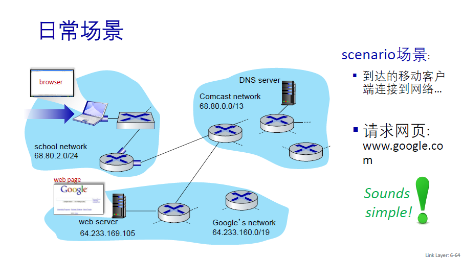
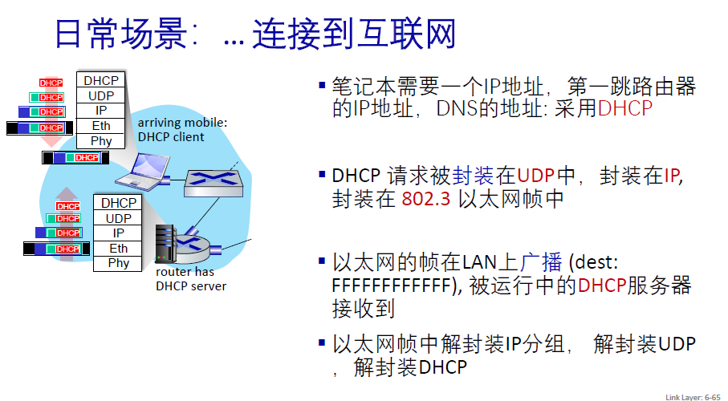
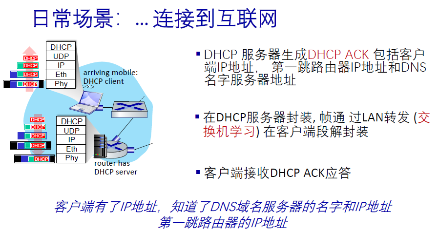
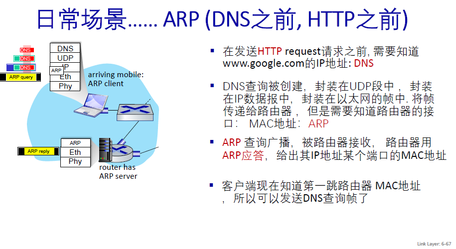
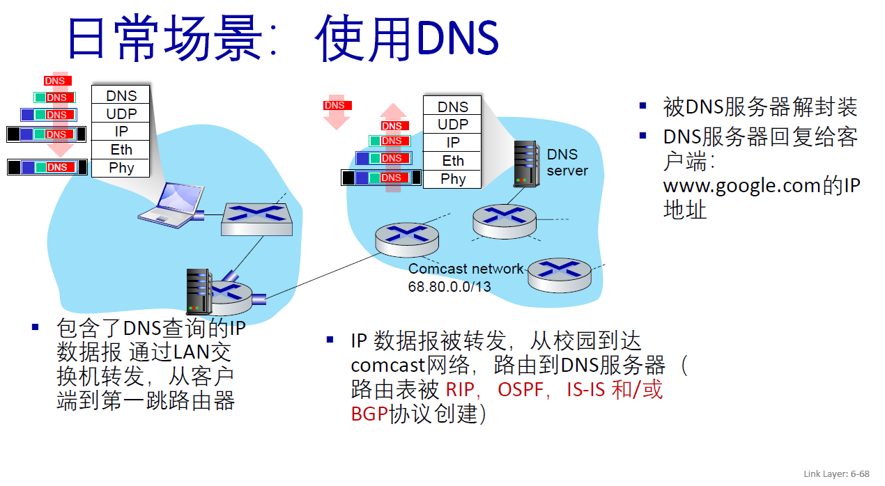
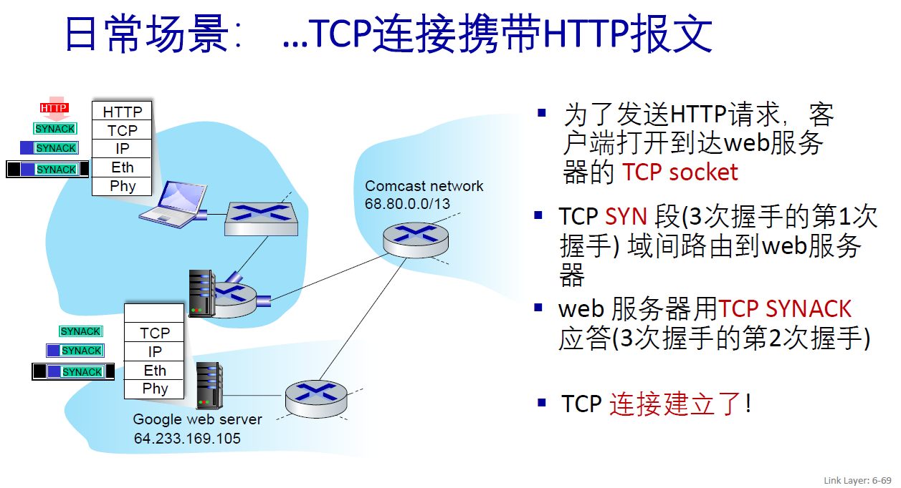
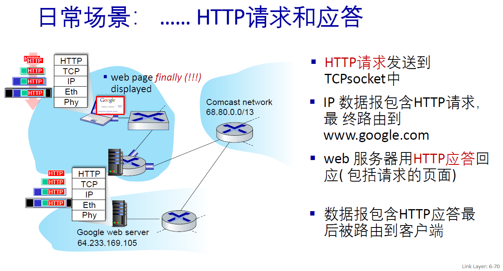

# 计算机网络

## 概述

### 网络的网络

网络把主机连接起来，而互连网（internet）是把多种不同的网络连接起来，因此互连网是网络的网络。而互联网（Internet）是全球范围的互连网。

### ISP (Internet Service Provider)

互联网服务提供商 ISP 可以从互联网管理机构获得许多 IP 地址，同时拥有通信线路以及路由器等联网设备，个人或机构向 ISP 缴纳一定的费用就可以接入互联网。

目前的互联网是一种多层次 ISP 结构，ISP 根据覆盖面积的大小分为第一层 ISP、区域 ISP 和接入 ISP。互联网交换点 IXP 允许两个 ISP 直接相连而不用经过第三个 ISP。

### 主机间的通信方式

- 客户-服务端（C/S）：客户是服务的请求方，服务器是服务的提供方。

- 对等（P2P）：不区分客户和服务器。

### 电路交换与分组交换

#### 1. 电路交换

用于电话通信系统，两个用户通信之前需要建立一条专用的物理链路，并且整个通信过程占用该链路。线路利用率低，往往不到10%。

#### 2. 分组交换

每个分组都有首部和尾部，包含了源地址和目的地址等控制信息，在同一个传输线路上同时传输多个分组互相不会影响，也就是说分组交换不需要占用传输线路。

在一个邮局通信系统中，邮局收到一份邮件之后，先存储下来，然后把相同目的地的邮件一起转发到下一个目的地，这个过程就是存储转发过程，分组交换也使用了存储转发过程。

### 时延

总时延 = 排队时延 + 处理时延 + 传输时延 + 传播时延

#### 1. 排队时延

分组在路由器的输入队列和输出**队列中排队等待**的时间，取决于当前网络通信量。

#### 2. 处理时延

主机或路由器收到分组后，进行处理需要的时间。例如分析首部、从分组中提取数据、进行差错检验或查找适当的路由等。

#### 3. 传输时延

主机或路由器传输数据帧所需要的时间。

其中 l 表示数据帧的长度，v 表示传输速率。

#### 4. 传播时延

电磁波在信道中传播所需要花费的时间，电磁波传播的速度接近光速。

其中 l 表示信道长度，v 表示电磁波在信道上的传播速度。

### 计算机网络体系结构

#### 1. 五层协议

- 应用层：为特定的应用程序提供数据传输服务，如：HTTP、DNS、FTP、SMTP等协议。数据单位：报文（Message）。
- 传输层：为进程提供数据传输服务。定义通用的传输层协议可以支持不断增多的应用层协议。包括两种协议：
  - 传输控制协议TCP，提供面向连接、可靠的数据传输服务，数据单位：报文段（Segment）。
  - 用户数据报协议UDP，提供无连接、尽最大努力的数据传输服务，数据单位：数据报（Datagram）。
- 网络层：为主机提供数据传输服务。网络层把传输层传递下来的报文段或数据报封装成分组。数据单位：分组（Packet）。如：IPv4和IPv6。
- 数据链路层：主机之间有很多链路，链路层为同一链路的主机提供数据传输服务。把网络层传下来的分组封装成帧（Frame）。如以太网（Ethernet），Wi-Fi，和蓝牙。
- 物理层：传输bit流，尽可能屏蔽传输媒体和通信手段的差异，使数据链路层感觉不到。

#### 2. OSI（Open Systems Interconnection）

- 表示层：数据压缩、加密以及数据描述，这使得应用程序不必关心在各台主机中数据内部格式不同的问题。
- 会话层：建立及管理回话。

五层协议将这些功能留给应用开发者处理。

#### 3. TCP/IP

相当于五层协议中数据链路层和物理层合并为网络接口层。

TCP/IP 体系结构不严格遵循 OSI 分层概念，应用层可能会直接使用 IP 层或者网络接口层。

#### 4. 数据在各层之间的传递过程

在向下的过程中，需要添加下层协议所需要的首部或者尾部，而在向上的过程中不断拆开首部和尾部。

路由器只有下面三层协议，因为路由器位于网络核心中，不需要为进程或者应用程序提供服务，因此也就不需要传输层和应用层。

## 物理层

### 通信方式

三种传输方式：

- 单工通信：单向传输
- 半双工通信：双向交替传输
- 全双工通信：双向同时传输

#### 带通调制

模拟信号是连续的信号，数字信号是离散的信号。带通调制把数字信号转换为模拟信号，以便在物理介质上发送的信号。

## 链路层

### 基本问题

#### 1. 封装成帧

将网络层传下来的分组（IP）添加首部和尾部，用于标记帧的开始和结束。

#### 2. 透明传输

透明表示一个实际存在的事物看起来好像不存在一样。

帧使用首部和尾部进行定界，如果帧的数据部分含有和首部尾部相同的内容，那么帧的开始和结束位置就会被错误的判定。需要在数据部分出现首部尾部相同的内容前面插入转义字符。如果数据部分出现转义字符，那么就在转义字符前面再加个转义字符。在接收端进行处理之后可以还原出原始数据。这个过程透明传输的内容是转义字符，用户察觉不到转义字符的存在。

下图中：

1. **SOH（Start of Header）**：在ASCII中，SOH的十进制值为1。它通常用于标记一段信息的开始，尤其是头部信息的开始。
2. **ESC（Escape）**：在ASCII中，ESC的十进制值为27。它通常用于引入一个转义序列，这是一种改变后续字符含义的机制。例如，在许多编程语言和命令行界面中，ESC字符可以用来引入一个颜色、格式或特殊字符的编码。
3. **EOT（End of Transmission）**：在ASCII中，EOT的十进制值为4。它通常用于标记一段信息的结束，尤其是在通信中标记传输的结束。

#### 3. 差错检测

目前广泛使用了循环冗余检验（CRC）来检查比特差错。

## 网络层

## 传输层

## 应用层

### 域名系统

DNS是一个分布式数据库（每个站点只保留自己的部分数据），提供了主机名和IP地址之间相互转换的服务。

域名具有层次结构，从上到下依次为：根域名、顶级域名、二级域名。

DNS可以用UDP或TCP传输，使用端口号都为53。大多数情况，DNS使用UDP传输，这就要求域名解析器和域名服务器都必须自己处理超时和重传以保证可靠性。两种情况下会使用TCP传输：

- 返回的响应超过UDP能携带的最大数据。
- 区域传送（是主域名服务器向辅助域名服务器传送变化的那部分数据）。

### 文件传送协议

FTP使用TCP进行连接，需要两个连接来传送一个文件：

- 控制连接：服务器打开端口号 21 等待客户端的连接，客户端主动建立连接后，使用这个连接将客户端的命令传送给服务器，并传回服务器的应答。
- 数据连接：传送一个文件数据。

根据数据连接是否是服务器端主动建立，FTP 有主动和被动（主语为服务器）两种模式：

- 主动模式：服务器端主动建立数据连接，其中服务器端的端口号为 20，客户端的端口号随机，但是必须大于 1024，因为 0~1023 是熟知端口号。

- 被动模式：客户端主动建立数据连接，其中客户端的端口号由客户端自己指定，服务器端的端口号随机。

主动模式要求客户端开放端口号给服务器端，需要去配置客户端的防火墙。被动模式只需要服务器端开放端口号即可，无需客户端配置防火墙。但是被动模式会导致服务器端的安全性减弱，因为开放了过多的端口号。

### 动态主机配置协议

DHCP (Dynamic Host Configuration Protocol) 提供了即插即用的连网方式，用户不再需要手动配置 IP 地址等信息。

DHCP 配置的内容不仅是 IP 地址，还包括子网掩码、网关 IP 地址。

DHCP 工作过程如下（跟找工作差不多……）：

1. 客户端发送 Discover 报文，该报文的目的地址为 255.255.255.255:67，源地址为 0.0.0.0:68，被放入 UDP 中，该报文被广播到同一个子网的所有主机上。如果客户端和 DHCP 服务器不在同一个子网，就需要使用中继代理。
2. DHCP 服务器收到 Discover 报文之后，发送 Offer 报文给客户端，该报文包含了客户端所需要的信息。因为客户端可能收到多个 DHCP 服务器提供的信息，因此客户端需要进行选择。
3. 如果客户端选择了某个 DHCP 服务器提供的信息，那么就发送 Request 报文给该 DHCP 服务器。
4. DHCP 服务器发送 Ack 报文，表示客户端此时可以使用提供给它的信息。

### 远程登录协议

TELNET（已经被SSH协议取代） 用于登录到远程主机上，并且远程主机上的输出也会返回。

TELNET 可以适应许多计算机和操作系统的差异，例如不同操作系统系统的换行符定义。

### 电子邮件协议

电子邮件系统组成部分：

- 用户代理
- 邮件服务器
- 邮件协议
  - 发送协议（常用SMTP）
  - 读取协议（常用POP3和IMAP）

#### 1. SMTP

SMTP 只能发送 ASCII 码，而互联网邮件扩充 MIME 可以发送二进制文件。MIME 并没有改动或者取代 SMTP，而是增加邮件主体的结构，定义了非 ASCII 码的编码规则。

#### 2. POP3

特点是只要用户从服务器上读取了邮件，就删除该邮件。已经被IMAP取代。

#### 3. IMAP

客户端和服务器上的邮件保持同步，如果不手动删除邮件，那么服务器上的邮件也不会被删除。IMAP 这种做法可以让用户随时随地去访问服务器上的邮件。

### 常用端口

| 应用             | 应用层协议 | 端口号  | 传输层协议 | 备注                        |
| ---------------- | ---------- | ------- | ---------- | --------------------------- |
| 域名解析         | DNS        | 53      | UDP/TCP    | 长度超过 512 字节时使用 TCP |
| 动态主机配置协议 | DHCP       | 67/68   | UDP        |                             |
| 简单网络管理协议 | SNMP       | 161/162 | UDP        |                             |
| 文件传送协议     | FTP        | 20/21   | TCP        | 控制连接 21，数据连接 20    |
| 远程终端协议     | TELNET     | 23      | TCP        |                             |
| 超文本传送协议   | HTTP       | 80      | TCP        |                             |
| 简单邮件传送协议 | SMTP       | 25      | TCP        |                             |
| 邮件读取协议     | POP3       | 110     | TCP        |                             |
| 网际报文存取协议 | IMAP       | 143     | TCP        |                             |

### Web 页面请求过程

#### 1. DHCP配置主机信息

- 假设主机最开始没有IP地址及其它信息，需要先试用DHCP获取。
- 主机生成DHCP请求报文，放入UDP数据报中，目的端口67，源端口68。
- 放入IP数据报中，广播 IP 目的地址(255.255.255.255) 和源 IP 地址（0.0.0.0）。
- 放入MAC帧中，具有目的地址FF:FF:FF:FF:FF:FF，将广播到与交换机连接的所有设备。
- 连接在交换机的DHCP服务器收到广播帧后，不断地向上分解得到 IP 数据报、UDP 报文段、DHCP 请求报文，之后生成 DHCP ACK 报文，该报文包含以下信息：IP 地址、DNS 服务器的 IP 地址、默认网关路由器的 IP 地址和子网掩码。该报文被放入 UDP 报文段中，UDP 报文段有被放入 IP 数据报中，最后放入 MAC 帧中。
- 该帧的目的地址是请求主机的 MAC 地址，因为交换机具有自学习能力，之前主机发送了广播帧之后就记录了 MAC 地址到其转发接口的交换表项，因此现在交换机就可以直接知道应该向哪个接口发送该帧。
- 主机收到该帧后，不断分解得到 DHCP 报文。之后就配置它的 IP 地址、子网掩码和 DNS 服务器的 IP 地址，并在其 IP 转发表中安装默认网关。

#### 2. ARP解析MAC地址

- 主机为了生成套接字，需要知道网站的域名对应的IP地址。
- 主机生成一个DNS查询报文，封装在UDP中。
- 放入IP数据报中，目的地址DNS服务器IP地址。
- 放入以太网帧中，将帧发送到网关路由器。
- 但是这时候还不知道网关路由器的MAC地址，因为DHCP过程只知道网关路由器的IP地址。因此需要使用ARP协议。
- 主机生成一个ARP查询报文，目的地址为网关路由器的IP地址。放入以太网帧中，具有广播目的地址FF:FF:FF:FF:FF:FF的以太网帧中，并向交换机发送该以太网帧，交换机转发给所有连接设备。
- 网关路由器接收后，不断分解得到ARP报文，发现其中IP地址与其接口IP地址匹配，因此发送ARP回答报文，包含了它的MAC地址，发回给主机。

#### 3. DNS解析域名

- 网关路由器接收到DNS查询以太帧后，抽取IP数据报，并根据转发表决定应该转发的路由器。
- 路由到NDS服务器的路由表由内部网关协议（RIP、OSPF）和外部网关协议（BGP）创建。
- 到达DNS服务器后，服务器抽取出DNS查询报文，并在DNS数据库中查找待解析的域名。
- 找到DNS记录后，发送DNS回答报文，放入UDP数据报中，放入IP数据报中，通过路由器反向转发回网关路由器，并经过以太网交换机到达主机。

#### 4. HTTP请求页面

- 有了HTTP服务器的IP地址后，主机生成TCP套接字，用于向Web服务器发送HTTP GET报文。
- 生成套接字之前，需要与服务器三次握手来建立连接。客户端生成一个SYN报文段（x），发送给服务器。
- 服务器发回SYN ACK报文段（x + 1, y）。
- 客户端发送ACK报文段（y + 1），连接建立。此步为第三次握手，可同时将HTTP GET报文发送给服务器。
- 服务器从TCP套接字中读取HTTP GET报文，生成HTTP响应报文，将Web页面内容发回给主机。
- 主机抽取出内容，渲染，显示Web页面。

